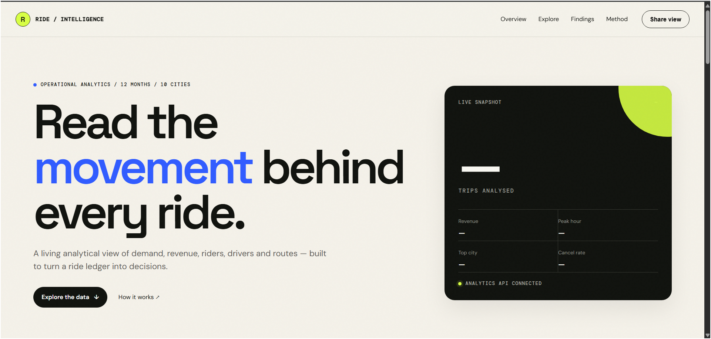

# 🚖 Ride-Sharing Analytics

Interactive analytics dashboard for a simulated ride-hailing platform: **100K+ trips**, 5K riders, 1K drivers across 10 Indian cities.

**🔗 Live demo:** https://ride-sharing-analytics-bvph.onrender.com  ·  **Stack:** MySQL · SQL · Python · Flask · JavaScript · Plotly



## What it does
- Four-tab dashboard (Overview, Drivers, Riders, Demand & Routes) with city, vehicle, payment and date filters
- KPI cards, auto-generated insights, hourly demand heatmap, driver rankings, cancellation analysis
- Revenue rule: **only completed trips count as revenue**; lost fares from cancellations are tracked separately

## Architecture
MySQL (3 tables + 1 analytics view) → Flask JSON API (cached, parameterized SQL) → Plotly charts in the browser

## Database
`riders (rider_id, rider_name, city, signup_date)` · `drivers (driver_id, driver_name, vehicle_type, city, joining_date)` ·
`trips (trip_id, rider_id, driver_id, trip_date, pickup_location, drop_location, distance_km, fare, trip_status, payment_method)`
Foreign keys, ENUMs and CHECK constraints enforce integrity.

## Key findings (from the generated data)
1. <e.g. Demand peaks at 18:00 and 19:00, X% of all trips>
2. <e.g. Delhi generates X% of revenue; Kolkata has the highest cancellation rate at X%>
3. <e.g. N drivers cancel above 30% of trips and drive ₹X of lost fares>
4. <e.g. Top 25% of riders produce X% of revenue>

> Data is synthetic and patterns reflect the generator's rules, not a real platform.

## Run locally
```bash
git clone https://github.com/YOUR-USERNAME/ride-sharing-analytics.git && cd ride-sharing-analytics
python -m venv venv && source venv/bin/activate        # Windows: venv\Scripts\activate
pip install -r requirements.txt
cp .env.example .env                                   # add your MySQL credentials
mysql -u root -p < schema.sql                          # creates ride_sharing_db with 3 empty tables
python seed_data.py                                    # fills them (about 1 minute) and validates
python app.py                                          # http://127.0.0.1:5000
```

## SQL showcase
`analysis.sql` contains 12 queries using CTEs, `RANK`, `ROW_NUMBER`, `LAG`, `NTILE`, running totals and moving averages.

## Endpoints
`GET /` dashboard · `GET /api/dashboard?city=&vehicle=&payment=&start=&end=` · `GET /api/filters` · `GET /health`

## Limitations and next steps
No surge-pricing model, ratings or GPS data. Next: cohort retention, cancellation prediction model, map view.